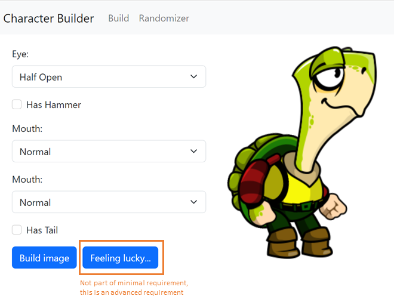

# Character Builder

## Introduction

Many companies offer configuration web apps for their products (e.g. configure a car online, configure your kitchen online). In this exam, you create a simplified configuration app. Instead of cars or kitchens, we configure a comic character.

## Web API

The Web API for configuring our character is available in the folder [api](api). It has been written in C# using .NET 8. Make sure to install the [.NET 8 SDK](https://dot.net) on your machine. Run `dotnet run` inside the [api](api) folder to start the API.

 The Swagger API documentation can be found at _/swagger/index.html_. The Swagger UI allows you to test the API.

> Start the exercise by making yourself familiar with the API. Read the included documentation carefully. Try it using Swagger.

The following image illustrates the relation between the API endpoints:

## Minimum Requirements

To get a positive grade, you must implement the following minimum requirements:

* Create an Angular 18 web app.
* Accessing the web API must be encapsulated in an Angular service.
* The web app must contain a route */build* that leads to the *character builder*.
* The character builder consists of a form in which the user can enter the image options (see Swagger documentation of Web API for details). Use proper input controls, Angular two-way data binding (`[ngModel]`), and Signals to implement the form. Offer a button that triggers the displaying of the generated image based on the image options that the user entered. Here is a screenshot of how the UI could look like:

  

* Focus on the functionality of the app, UI design is less important for minimum requirements.

## Advanced Requirements

Implement the following requirements to get more than just a positive grade. The grade is determined by the completeness and quality of your implementation.

* The design of your UI must be clean and tidy.
* Add a button *Feeling lucky...* to the character builder form. If the user clicks it, you have to call the */get-random-image-options* API to generate random image options. Update the form's content based on the result of the web API.
* Refresh the displayed character image automatically after the user clicked *Feeling lucky...* and you have updated the form's content.
* Add a second route *randomizer*.
  * Generate a random character image and display it.
  * Offer a *+* button to zoom in (i.e. make the image larger) and a *-* button to zoom out (i.e. make the image smaller). Use the *scale* parameter of the */img* Web API for that. Do *not* generate a new, random image when zooming.
  * Offer a *Next* button to randomly generate another character image.
  * Here is a screenshot of how the randomizer could look like:

    
